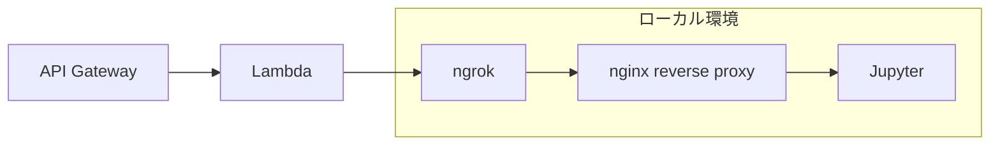

## はじめに
ChatGPTの「Code Interpreter」機能は、有償サービス「ChatGPT Plus」(月額20ドル)の登録ユーザーに提供されています。この機能を使うと、質問や指示に対してGPT-4による自然言語の回答だけでなく、プログラミング処理が必要な場合はPythonコードとその実行結果も得られます。このコードはサーバー上のPython実行環境で処理され、ユーザーの端末には何もインストールする必要がありません。これにより、安全にPythonプログラムを生成・実行できます。
ただし、追加のpythonライブラリのインストールなどのインターネットに接続が必要な処理は実行することができません。
本記事はpythonの実行環境であるJupyterをローカル環境に構築し、GPTsからJupyter APIを呼び出すことでローカルで動作する「Code Interpreter」を構築したので、その手順を書いてみたいと思います。

## アーキテクチャ
今回は以下のような構成で環境を構築しました。
jupyterはEC2のようなインスタンスにデプロイしても良いのですが、常時利用しないためngrok経由でサーバを公開してAWS lambdaから接続できるようにしました。
またセキュリティを確保するためにnginxでAWSのIPレンジのみを許可するリバースプロキシを構築しました。


## Jupyterの構築
まずはローカル環境から先に構築します。
構築に必要なコードはこちらにまとめました。

**1. リポジトリのclone**
```bash
git clone https://github.com/tatsuiman/jupyter-ngrok-worker
cd jupyter-ngrok-worker
```

**2. 環境変数の設定**
こちらからngrokに登録しauthtokenを取得します。
公式ページにログインした後の「Setup & Installation」のページにコマンドが書いてあります。

https://ngrok.com/

取得したら.envファイルに`NGROK_AUTH`に値を設定します。`JUPYTER_TOKEN`には任意の文字列を設定します。
```bash
cp env.sample .env
vim .env
```

**3. nginxの設定**
自身のグローバルIPアドレスを取得し`docker/nginx/nginx.conf`のホワイトリストにIPアドレスを追加します。
```bash
curl ifconfig.io
vim docker/nginx/nginx.conf
```

**4. dockerのビルドと起動**
dockerをビルドして起動します。


```bash
docker-compose up -d --build
```

起動が完了したらngrokの管理画面から接続URLを確認してブラウザで開いてみます。

https://dashboard.ngrok.com/cloud-edge/endpoints


## AWS API Gateway Lambdaのデプロイ
はじめにリポジトリをクローンします
```bash
git clone https://github.com/tatsuiman/GPTs-Actions
cd GPTs-Actions
```

serverlessフレームワークをインストールします。
```bash
npm install -g serverless
serverless plugin install -n serverless-api-gateway-throttling
serverless plugin install -n serverless-prune-plugin
```

```bash
cp env.sample .envrc
source .envrc
```

`.envrc`は主にFunction Callingで使用するツールのAPIキーや設定のための環境変数が定義されいますが、今回は`JUPYTER_HOST`と`JUPYTER_TOKEN`以外は設定しなくて良いです。
* `JUPYTER_HOST`: ngrokの接続先のホスト名`<random-string>.ngrok-free.app`
* `JUPYTER_TOKEN`: Jupyter構築時に設定した任意の文字列
`JUPYTER_HOST`はdockerを再起動してしまうと変わってしまうので、変更された場合はAWSの再デプロイが必要です。


デプロイを実行します。
```bash
aws ecr-public get-login-password --region us-east-1 | docker login --username AWS --password-stdin public.ecr.aws
sls deploy
```

以下のようにエンドポイントとAPI Keyが出力されるので覚えておきます。
```
Running "serverless" from node_modules

✔ Service deployed to stack GPTs-Actions-dev (138s)

api keys:
  dev-free-key: xxxxxxxxxxxxxxxx
endpoints:
  POST - https://xxxxxxxx.execute-api.ap-northeast-1.amazonaws.com/dev
```

## GPTsの作成
GPTsの作成画面から`Code Interpreter`GPTsを作成します
https://chat.openai.com/gpts/editor


Instructionsには以下を設定します。
```
あなたは与えられた指示を達成できるまでJupyterでコードを実行します。
コードを実行するためには最初に1回だけkernelを作成しkernel_idを取得する必要があります。
コード実行は最初に取得したカーネルIDを使用し続けます。
また、jupyter標準ライブラリ以外を利用する場合は`!pip install`でインストールしてからコードを実行してください。
```

新しいアクションを作成し`Actions`に以下を設定します。
`servers.url`はデプロイ時のエンドポイントに置き換えてください。

:::details Actions
{
  "openapi": "3.1.0",
  "info": {
    "title": "Code Interpreter API",
    "description": "Execute code in a jupyter kernel",
    "version": "v1.0.0"
  },
  "servers": [
    {
      "url": "https://xxxxxxxx.execute-api.ap-northeast-1.amazonaws.com/dev"
    }
  ],
  "paths": {
    "/jupyter_create_kernel": {
      "post": {
        "description": "Create a new kernel",
        "operationId": "jupyter_create_kernel",
        "tags": [
          "Jupyter",
          "Initialize"
        ],
        "requestBody": {
          "required": true,
          "content": {
            "application/json": {
              "schema": {
                "type": "object",
                "properties": {},
                "required": []
              }
            }
          }
        },
        "responses": {
          "200": {
            "description": "Kernel created successfully",
            "content": {
              "application/json": {
                "schema": {
                  "type": "object",
                  "properties": {
                    "kernel_id": {
                      "type": "string",
                      "description": "Kernel ID"
                    }
                  }
                }
              }
            }
          }
        }
      }
    },
    "/jupyter_execute_code": {
      "post": {
        "description": "Execute code in a kernel",
        "operationId": "jupyter_execute_code",
        "tags": [
          "Jupyter",
          "Execute"
        ],
        "requestBody": {
          "required": true,
          "content": {
            "application/json": {
              "schema": {
                "type": "object",
                "properties": {
                  "code": {
                    "type": "string",
                    "description": "Code to execute"
                  },
                  "kernel_id": {
                    "type": "string",
                    "description": "Kernel ID"
                  }
                },
                "required": [
                  "code",
                  "kernel_id"
                ]
              }
            }
          }
        }
      }
    }
  },
  "components": {
    "schemas": {}
  }
}
:::

認証にはAWSへのデプロイ時に出力されたAPIキーを設定します。


適当なアイコンを設定したら完成です。
GPTsを開いて質問してみましょう。

GPTsがコードを実行した履歴はJupyter Notebookから確認することができます。


## まとめ

この記事では、Jupyter Notebook上でコードを実行するためのGPTsアクションの設定方法について説明しました。
Code Interpreterがインターネットに接続できるようになることで、外部APIへのリクエストを行うこともできるため、APIの動作確認やデータの取得、外部サービスとの連携など、実際の業務で直面する様々なシナリオをテストすることが可能です。
実際の業務での応用例としては、バックエンドのAPI開発時にリアルタイムでエンドポイントのテストを行ったり、フロントエンドの開発では外部APIから取得したデータを用いてUIの動作確認を行うなどが挙げられるかと思います。

今回解説したセルフホストCode Interpreter以外にも、ナレッジ管理に特化したGPTsアクションをいくつか作成して公開しておりますのでぜひ使ってみてください。
https://github.com/tatsuiman/GPTs-Actions
https://zenn.dev/tatsui/articles/slack-copilot
