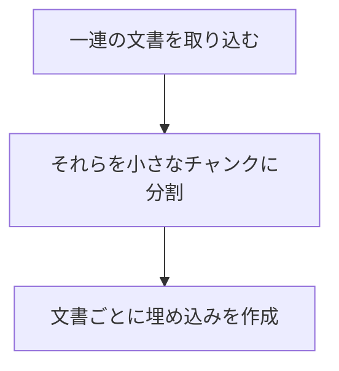
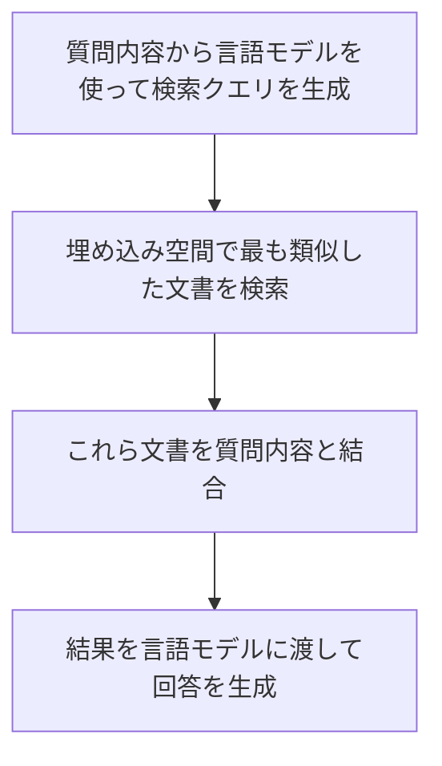

## はじめに
ChatGPTを使って最新の情報を調べようとした時に困った事はないでしょうか？
現在のChatGPTの言語モデル(gpt-3.5-turbo-0301)は2021年9月までのデータを学習して作られており、最新の情報について質問しても正しく答えられない事がほとんどです。
:::message
最近出たばかりのフレームワークについては知りません。
:::

今回はChatGPTに新しい知識をあたえて、思考の連鎖(Chain of Thought)を使った受け答えができるチャットボットの作成方法について解説していきます。

## 学習データの準備と取り込み
はじめに学習データとしてRemixのソースコードをクローンします。
```bash
!git clone https://github.com/remix-run/remix
!rm -rf remix/.git
```

以下のようにremixリポジトリのファイルをテキストファイルとして取り込みます。



OpenAI APIキーを記述した以下のコードを使って文書の取り込みを行います。
```python
import os
import pickle
from langchain.document_loaders import DirectoryLoader, TextLoader
from langchain.embeddings import OpenAIEmbeddings
from langchain.text_splitter import RecursiveCharacterTextSplitter
from langchain.vectorstores.faiss import FAISS

openai_api_key= "<OPENAI API KEY を記述してください>"
os.environ["OPENAI_API_KEY"] = openai_api_key

def ingest_docs(dir_name):
    # (1) 一連の文書を取り込む。
    loader = DirectoryLoader(dir_name, loader_cls=TextLoader, silent_errors=True)
    raw_documents = loader.load()
    # (2) 小さなチャンクに分割。
    text_splitter = RecursiveCharacterTextSplitter(
        chunk_size=800,
        chunk_overlap=200,
    )
    documents = text_splitter.split_documents(raw_documents)
    # (3) 文書ごとに埋め込みを作成。(text-embedding-ada-002が使用されます)
    embeddings = OpenAIEmbeddings()
    vectorstore = FAISS.from_documents(documents, embeddings)

ingest_docs("remix")
```

## チャットボットの作成
続いてLLMチェーンを使った簡単なチャットボットの作成を行います。
```python
from langchain.chains.llm import LLMChain
from langchain.callbacks.base import CallbackManager
from langchain.callbacks.streaming_stdout import StreamingStdOutCallbackHandler
from langchain.chains.chat_vector_db.prompts import CONDENSE_QUESTION_PROMPT, QA_PROMPT
from langchain.chains.question_answering import load_qa_chain
from langchain.vectorstores.base import VectorStore
from langchain.chains import ChatVectorDBChain
from langchain.llms import OpenAIChat

# 標準出力にストリーミングで回答を出力するためのコールバック関数
manager = CallbackManager([StreamingStdOutCallbackHandler()])

streaming_llm = OpenAIChat(streaming=True, callback_manager=manager, verbose=True, temperature=0)
question_gen_llm = OpenAIChat(temperature=0, verbose=True, callback_manager=manager)
# チャット履歴と新しい質問を取り込み、独立した質問を生成するプロンプト
question_generator = LLMChain(llm=question_gen_llm, prompt=CONDENSE_QUESTION_PROMPT)
# ドキュメントとスタンドアローンの質問を取り込み、質問に答えるためのプロンプトを渡す
doc_chain = load_qa_chain(streaming_llm, chain_type="stuff", prompt=QA_PROMPT)
# 埋め込みモデルからプロンプトを生成する
qa = ChatVectorDBChain(vectorstore=vectorstore, combine_docs_chain=doc_chain, question_generator=question_generator)
```

ChatGPTのAPIに与えられるプロンプトは以下の手順で作成されます。



```python
question = "remixは既存のフレームワークと何が違うのですか？日本語で箇条書きにしてください"
qa({"question": question, "chat_history": []})
```

## 質問してみる
```markdown
remixは既存のフレームワークと何が違うのですか？
日本語で箇条書きにしてください
```

以下のコンテキストを要約した箇条書きとして回答が出力されます。
```python
# 質問に関連したコンテキストを埋め込みモデルから取得
for context in vectorstore.similarity_search(question):
    print(context)
```

```markdown
Remix's job is to cross the center of the stack and then get out of your way. We avoid as many "Remixisms" as possible and instead make it easier to use the standard APIs the web already has.

This one is more for us. We've been educators for the 5 years before Remix. Our tagline is Build Better Websites. We also think of it with a little extra on the end: Build Better Websites, Sometimes with Remix. If you get good at Remix, you will accidentally get good at web development in general.

Remix's APIs make it convenient to use the fundamental Browser/HTTP/JavaScript, but those technologies are not hidden from you.

Additionally, if Remix doesn't have an adapter for your server already, you can look at the source of one of the adapters and build your own.

## Server Framework
If you're familiar with server-side MVC web frameworks like Rails and Laravel, Remix is the View and Controller, but it leaves the Model up to you. There are a lot of great databases, ORMs, mailers, etc. in the JavaScript ecosystem to fill that space. Remix also has helpers around the Fetch API for cookie and session management.

Instead of having a split between View and Controller, Remix Route modules take on both responsibilities.

Most server-side frameworks are "model focused". A controller manages multiple URLs for a single model.

## Welcome to Remix!
We are happy you're here!

Remix is a full stack web framework that lets you focus on the user interface and work back through web fundamentals to deliver a fast, slick, and resilient user experience that deploys to any Node.js server and even non-Node.js environments at the edge like Cloudflare Workers.

Want to know more? Read the Technical Explanation of Remix

This repository contains the Remix source code. This repo is a work in progress, so we appreciate your patience as we figure things out.

## Documentation
For documentation about Remix, please
```

## 最終的な回答
```
- Remixは、標準的なAPIを使用しやすくすることを目的としています。
- Remixは、Web開発全般について学ぶことができます。
- Remixは、ViewとControllerの役割を担うフレームワークです。
- Remixは、モデルについてはユーザーに任せています。
- Remixは、Fetch APIに関するヘルパーを提供しています。
- Remixは、Node.jsサーバーおよびCloudflare Workersなどの非Node.js環境にデプロイできます。
```

## API利用の注意点
Web上でのChatGPTについては、（2023年3月10日現在は）引き続きオプトアウト形式の仕様(申請することで再学習に利用されない)ですが、ChatGPI APIはオプトイン形式(申請しない限り再学習には利用されない)であり実質モデルの改善に利用されないことになりました。(法的監視で30日は保管されます)
API経由での実行は再学習に利用されずOpenAI以外の第三者に漏洩するリスクが減ったので、非公開な情報をChatGPTで活用するハードルが下がったように思われます。
APIの価格については(gpt-3.5-turbo)は1000トークンあたり0.002ドルで、埋め込みモデル(text-embedding-ada-002)は1000トークンあたり0.0004ドルという計算なので比較的安価ですが、大量のファイルに対して埋め込みモデルを作成しようとすると予想以上にお金がかかります。
トークン数があらかじめ予測不能な場合は、以下のように事前に価格を計算して実行するかどうかの判断を行うのが良いでしょう。
```python
import tiktoken

encoding = tiktoken.encoding_for_model("text-embedding-ada-002")
text = ""
for doc in documents:
    text += doc.page_content.replace("\n", " ")
token_count = len(encoding.encode(text, allowed_special='all'))
print(f"予想価格: {token_count*0.00000004} USD")
```

## まとめ
ChatGPTは過去のデータを使って学習しているため、最新の情報やインターネットに公開されていない情報に対する質問に答えることができませんでした。
今回はプロンプトに質問内容に関連したコンテキストを混ぜて質問することによって、最新のデータやローカルに保存されたファイルに関する質問に答えられるようになりました。
以下は[フィッシングハンター](http://phishing-hunter.com)に関連したソースコードをチャットボットに読み込ませてみましたが、機能一覧や使い方などを回答してくれました。
@[tweet](https://twitter.com/hunter_phishing/status/1633423217523310593)

本記事のサンプルコードはこちらに整理して置いてあります。
https://github.com/tatsu-i/chatbot-sample
この記事を読んで、少しでもお役に立てたなら幸いです。何か質問やご意見がありましたら、お気軽にご連絡ください。

## 参考
https://note.com/npaka/n/nf74a29c1d25d
https://www.nogawanogawa.com/entry/faiss
