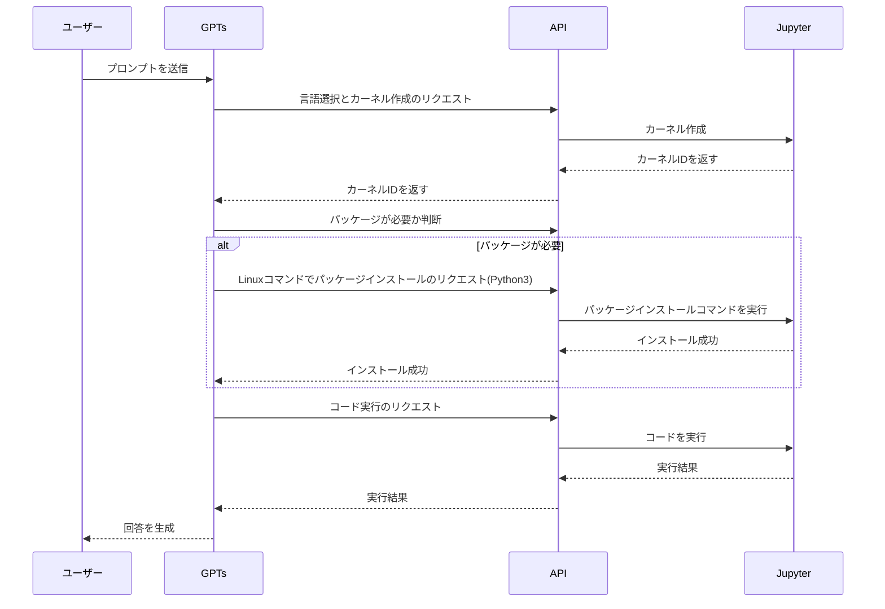

## 1. Code Interpreterを使ったAI駆動開発
ChatGPTのCode InterpreterモードではChatGPTが生成したpythonコードを実行し、実行結果から修正のコード生成やテストを生成します。
これによって以下のようなタスクをAI駆動開発で進めることができるようになりました。
1. コード生成とリファクタリング
2. 自動文書化
3. バグの検出と説明

しかし、Code InterpreterはPython以外の言語では動作しないため、Python言語をあまり使わない人にとってはAI駆動開発の恩恵が少ないかもしれません。
そこで本記事では、Python以外の言語でCode Interpreterを動かす方法について解説していきたいと思います。


## 2. Code Interpreterをローカルに構築する
はじめにローカルで動作するCode Interpreterとコードを実行するためのGPTsを構築します。
具体的な構築方法についてはこちらの記事に手順をまとめております。
https://zenn.dev/tatsui/articles/gpts-actions

以下は構築したGPTsが呼び出すAPIの一覧です。

* jupyter_create_kernel: カーネルの作成を行います
* jupyter_execute_code: 作成したカーネルでコードを実行します
* jupyter_run_command: 作成したカーネルでLinuxコマンドを実行します

カーネルはコードを実行するための環境のことで、各言語に応じて適切なカーネルを選択しコードの実行を行います。
カーネルの作成、コードの実行、コマンドの実行にはそれぞれ専用のAPIが用意されており、これらを通じてGPTsはJupyter上で柔軟にコーディングの作業を進めることができます。

GPTsがコードを実装する流れは以下のようなシーケンス図になります。


実際に実行してみると、ライブラリが不足している場合は自動でインストールを行い、エラーの修正まで実行してくれました。
ここまででも、通常のCode Interpreterモードでは実現できないようなAI駆動開発が実現できているように見えますね。


さらに[AutoDev](https://medium.com/@robertoelhajjboutros/microsoft-autodev-automated-ai-driven-development-b2d46df6afe7)のような状態に近づけていくために、多言語への対応をしていきたいと思います。
まずC言語でのビルドと実行を行うためにコンパイラをJupyterにインストールしてみます。
```dockerfile
# Jupyterのベースイメージを使用
FROM jupyter/base-notebook

# jupyter_server_config.pyを作成または編集
RUN echo "c.MappingKernelManager.cull_idle_timeout = 600  # 10 minutes in seconds" >> ~/.jupyter/jupyter_server_config.py \
    && echo "c.MappingKernelManager.cull_interval = 60  # Check every minute" >> ~/.jupyter/jupyter_server_config.py \
    && echo "c.MappingKernelManager.cull_connected = True  # Even if a browser tab is open" >> ~/.jupyter/jupyter_server_config.py

USER root

# 必要なパッケージのインストール
RUN apt-get update && apt-get install -y build-essential curl git
```

C言語でHello Worldを書くように指示すると、pythonの構文を使ってC言語のソースコードを出力してからGCCでコンパイルをした後にプログラムを実行しようとします。
これでは使い勝手が悪いので、せっかくなのでいろんな言語のカーネルをJupyterにインストールして色々試してみることにしました。
@[tweet](https://twitter.com/tatsuiman/status/1774419524164464664)

## 3. カーネルをインストールする
先ほどのDockerfileを修正して、C++,Java,Go,Ruby,JavaScript,TypeScript,Rustのカーネルをインストールします。

```dockerfile
# Jupyterのベースイメージを使用
FROM jupyter/base-notebook

# jupyter_server_config.pyを作成または編集
RUN echo "c.MappingKernelManager.cull_idle_timeout = 600  # 10 minutes in seconds" >> ~/.jupyter/jupyter_server_config.py \
    && echo "c.MappingKernelManager.cull_interval = 60  # Check every minute" >> ~/.jupyter/jupyter_server_config.py \
    && echo "c.MappingKernelManager.cull_connected = True  # Even if a browser tab is open" >> ~/.jupyter/jupyter_server_config.py

USER root

# 必要なパッケージのインストール
RUN apt-get update && apt-get install -y build-essential curl git

# RubyのJupyterカーネルをインストール
RUN apt-get install -y ruby ruby-dev
RUN gem install ffi-rzmq
RUN gem install iruby --pre
RUN iruby register --force

# Node.jsのインストール
RUN curl -fsSL https://deb.nodesource.com/setup_current.x | bash - \
    && apt-get install -y nodejs

# TypeScriptのJupyterカーネル（tslab）をインストール
RUN npm install -g tslab \
    && tslab install

# xeus-clingのインストール
RUN conda install -c conda-forge xeus-cling

# Go and GoNB Libraries
ENV GO_VERSION=1.22.0
ENV GONB_VERSION="v0.9.6"
ENV GOROOT=/usr/local/go
ENV GOPATH=/opt/go
ENV PATH=$PATH:$GOROOT/bin:$GOPATH/bin
RUN mkdir ${GOPATH} && chown ${NB_USER}:users ${GOPATH}
WORKDIR /usr/local
RUN wget --quiet --output-document=- "https://go.dev/dl/go${GO_VERSION}.linux-amd64.tar.gz" | tar -xz \
    && go version

# IJavaのインストール
RUN apt-get update && apt-get install -y default-jdk
RUN wget https://github.com/SpencerPark/IJava/releases/download/v1.3.0/ijava-1.3.0.zip \
    && unzip ijava-1.3.0.zip -d /tmp/ijava \
    && cd /tmp/ijava \
    && python install.py --sys-prefix

# Rustのインストール
RUN curl https://sh.rustup.rs -sSf | sh -s -- -y
ENV PATH="/home/${NB_USER}/.cargo/bin:${PATH}"

# RustのJupyterカーネル（evcxr_jupyter）をインストール
RUN cargo install evcxr_jupyter \
    && evcxr_jupyter --install

# 所有権の変更
RUN chown -R 1000 /home/${NB_USER}

USER ${NB_USER}

WORKDIR ${HOME}
RUN export GOPROXY=direct && \
    go install "github.com/janpfeifer/gonb@latest" && \
    go install golang.org/x/tools/cmd/goimports@latest && \
    go install golang.org/x/tools/gopls@latest && \
    gonb --install
```

## 4. 動作確認(インタプリタ言語)
どれも正常に実行することができました。Code Interpreterというだけあってインタプリタ言語との相性は良いみたいですね。
### Ruby

### JavaScript

### TypeScript


## 5. 動作確認(コンパイル言語)
それではコンパイル言語も見てみましょう。
### C++


### Java


### Go


### Rust


:::message
コンパイル言語に関しては、Jupyterの独自のコード実行環境であるため標準出力に出力するようなコードを書くことができませんでした。
個別の言語に特化したファインチューニングが必要かもしれません。
:::

## 5. まとめ
この記事では、Python以外の言語でもChatGPTのCode Interpreterを使用できるようにする方法について解説しました。
Jupyterはローカルで動作するため以下のようなカスタマイズが考えられます。

* よく使うライブラリを予めインストールしておいて実装待ち時間を短縮
* クラウドの認証情報を与えておくことでクラウド環境のAI駆動開発

また[こちら](https://medium.com/@robertoelhajjboutros/microsoft-autodev-automated-ai-driven-development-b2d46df6afe7)に記載してあるように、クラウド環境の認証情報を与える場合は最小権限に抑えることでガードレールを設定することが重要です。