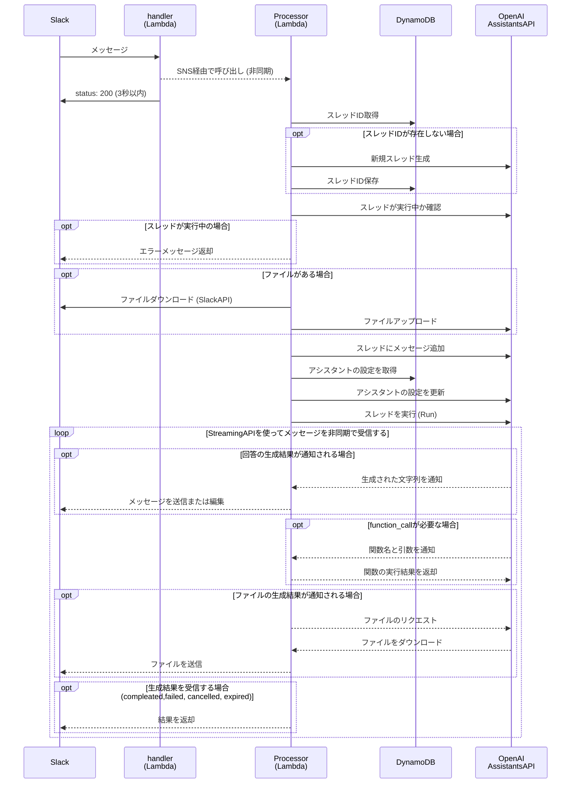
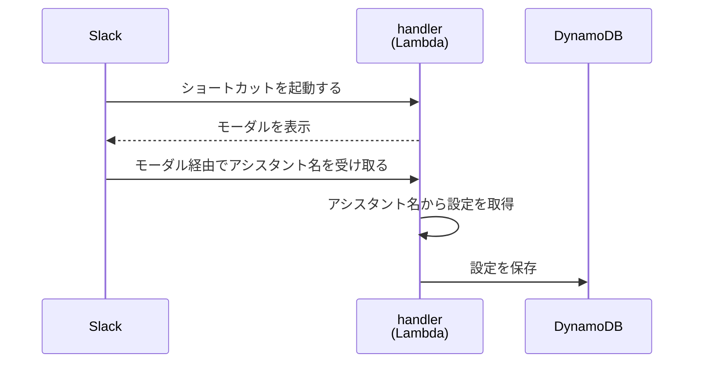

## はじめに
OpenAI AssistantsAPI を使用すると、独自のアプリケーションに AI アシスタントを組み込むことができます。
3/14にストリーミングAPIが追加され、ChatGPTのようなリアルタイムに応答ができるチャットボットを構築できるようになりました。
今回は AssistantsAPI (Streaming) を使用して Slack 上で AI とチャットができる環境を構築したので、その構築手順を書いてみたいと思います。
GPTs も便利ですが、Slack 上でのチャットを可能にすることで、ChatGPT のプランに関係なくワークスペースの全てのメンバーが AI アシスタントを使用できます。(GPTs と違って従量課金になるのでその点は注意が必要です。)

実装コードは以下のリポジトリに公開しております。
https://github.com/tatsu-i/slack-copilot

:::message
OpenAI の Assistants API は現在まだベータ版です。
今後も実装方法やAPIが変更される可能性がありますので、最新の公式ドキュメントを参照してください。
:::
構築したアプリケーションはこちらの構成を参考にしております。
https://zenn.dev/taroshun32/articles/slack-chatbot-with-openai-asistant

## 前提

この記事では、以下の技術を使用して構築を行います。
詳しい解説は省略しますので、概要は公式ドキュメントを参照してください。

* [Serverless (Lambda)](https://www.serverless.com/)
* [OpenAI Assistants API Streaming](https://platform.openai.com/docs/assistants/overview?context=with-streaming)
* [Slack App](https://api.slack.com/lang/ja-jp)

## 動作イメージ
以下のようにslackでもGPTsと同じようなことができるようになります。
### 1. Function calling 🤖

### 2. Code Interpreter 🐍

### 3. GPT mentions(アシスタントの切り替え)


## アーキテクチャ
今回構築したアプリケーションのアーキテクチャは以下のようになっています。
SNSを使って再度Lambda関数を呼び出しているのはSlackアプリケーションから呼び出されるWebhookは3秒以内にレスポンスを返さなければならないためです。
まず1つ目のLambda関数がslackアプリケーションから送信されたメッセージをSNSに送信します。
その後2つ目のLambda関数がSNS経由で呼び出されOpenAIのAPI呼び出しを非同期に実行します。


## 動作フロー
Slackアプリケーションの動作フローです。
アプリケーションの実装パターンはこちらの記事が参考になります。
https://qiita.com/namutaka/items/233a83100c94af033575

* Events API


* ショートカットコマンド


## デプロイ方法
はじめにリポジトリをクローンして環境変数の読み込みを行います。
```bash
git clone https://github.com/tatsu-i/slack-copilot
cd slack-copilot
cp env.sample .envrc
source .envrc
```
`.envrc`は主にFunction Callingで使用するツールのAPIキーや設定のための環境変数が定義されていますが今はすべて空のままで大丈夫です。

serverlessフレームワークをインストールします。
```bash
npm install -g serverless
serverless plugin install -n serverless-api-gateway-throttling
serverless plugin install -n serverless-prune-plugin
```

デプロイを実行します。
```bash
aws ecr-public get-login-password --region us-east-1 | docker login --username AWS --password-stdin public.ecr.aws
sls deploy
```
実行すると以下のように出力されますのでエンドポイントのURLをコピーします。

```bash
Running "serverless" from node_modules

Deploying open-slack-ai to stage dev (ap-northeast-1)
[serverless-api-gateway-throttling] No HTTP API (API Gateway v2) found. Throttling settings will be ignored for HTTP API endpoints.
✔ Pruning of functions complete
[serverless-api-gateway-throttling] Updating API Gateway REST API throttling settings (1 of 1).
[serverless-api-gateway-throttling] Done updating API Gateway REST API throttling settings.

✔ Service deployed to stack open-slack-ai-dev (74s)

endpoint: POST - https://xxxxxxxxxx.execute-api.ap-northeast-1.amazonaws.com/dev/
functions:
  slackai-handler: open-slack-ai-dev-slackai-handler
  slackai-processor: open-slack-ai-dev-slackai-processor

1 deprecation found: run 'serverless doctor' for more details

Need a faster logging experience than CloudWatch? Try our Dev Mode in Console: run "serverless dev"
```

上記で出力されたエンドポイントURL環境変数に設定しslackアプリケーションの設定ファイルを出力します。
```bash
export WEBHOOK_URL="https://xxxxxxxxxx.execute-api.ap-northeast-1.amazonaws.com/dev/"
envsubst < manifest.yaml
```

[こちら](https://api.slack.com/apps)から適当な名前のSlackアプリケーションを作成し、上記で出力された内容をApp Manifestの画面に貼り付けて保存するとslackアプリケーションの設定が完了します。


以下の環境変数を設定してから再デプロイを行なってください。

```bash
# 以下は必ず設定してください。
export SLACK_SIGNING_SECRET="「Basic Information」→「App Credentials」→「Signing Secret」に設定した値を設定します"
export SLACK_BOT_TOKEN="「OAuth & Permissions」→「Bot Token Scopes」→「OAuth Tokens for Your Workspace」に設定した値を設定します"
export SLACK_USER_TOKEN="「OAuth & Permissions」→「User Token Scopes」→「OAuth Tokens for Your Workspace」に設定した値を設定します"
export OPENAI_API_KEY="OpenAIのAPIキーを設定します"
```

再デプロイ
```bash
sls deploy
```

## 独自のFunctionやアシスタントを作成する方法

Function Callingから呼び出す関数は拡張することが可能です。
まず`src/scripts/function/`に以下のようなpythonファイル`my_youtube_transcript.py`を作成してください。
```python
import os
import sys
import logging
from youtube_transcript_api import YouTubeTranscriptApi

def run(url, language=["ja"]):
    video_id = url.split("=")[-1] if "=" in url else url.split("/")[-1]
    # 字幕リストを取得
    transcript_list = YouTubeTranscriptApi.list_transcripts(video_id)
    # 英語字幕は"en"に変更
    transcript = transcript_list.find_generated_transcript(language)
    text = ""
    transcript_text = ""
    for d in transcript.fetch():
        text = d["text"]
        transcript_text += f"{text}\n"
    return transcript_text
```

次に`src/scripts/data/assistant.yml`に以下のように追記します。
Yamlファイルの定義はGPTsで作成するアシスタントのようなものです。
```yaml
youtube_transcript:
  name: Youtubeアシスタント
  instructions: |
    Youtube URLから字幕を生成し質問に回答するアシスタントです
  tools:
    - function:
        description: Open Youtube URL
        name: my_youtube_transcript
        parameters:
          properties:
            url:
              description: youtube url string
              type: string
          required:
            - url
          type: object
      type: function
```
最後に再デプロイを行うことで`/`コマンドで`Youtubeアシスタント`を選択できるようになります。

## まとめ
今回はGPTsのような機能をslackで利用するためのアプリケーションを構築しました。
Streaming利用時のFunction Callingの実装方法に関するドキュメントがあまりなかったので少しだけ苦労しました。
slackではChatGPTと違い複数人が参加して会話できるため、スレッドの要約や会話の取りまとめなどのタスクもこなしてくれます。
実際の業務では、社内のナレッジ管理ツールと接続することでナレッジ検索アシスタントが簡単に構築できそうですね。

こちらはインシデント対応時のアシスタント活用のデモ動画です。


## 参考
https://zenn.dev/taroshun32/articles/slack-chatbot-with-openai-asistant
https://qiita.com/Cartelet/items/f64787cd0ae57c0a6830
https://zenn.dev/yutakobayashi/articles/gpts-notion-api
